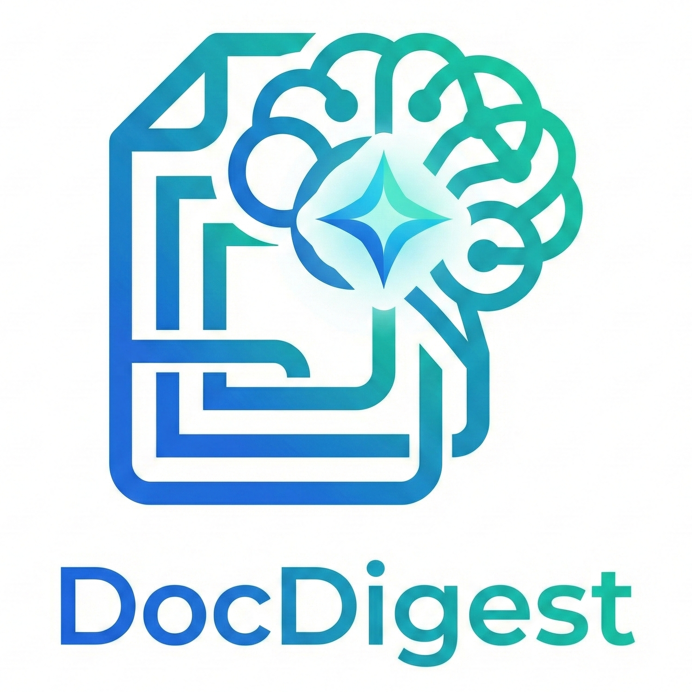

# 🤖 DocDigest - AI Document Summarization



> **Intelligent document summarization powered by Google Gemini AI**

[](https://python.org)
[](https://flask.palletsprojects.com)
[](https://ai.google.dev)
[](LICENSE)

---

## 📋 Descrizione

**DocDigest** è un'applicazione web AI-powered che genera riassunti intelligenti da documenti in pochi secondi. Supporta più formati di file, lingue e offre funzionalità di traduzione automatica basate su Google Gemini 2.5 Flash.

---

## ✨ Funzionalità

- 📄 **Multi-Formato**: Supporta file TXT, PDF e DOCX
- 🧠 **AI Avanzata**: Powered by Google Gemini 2.5 Flash
- 📏 **Lunghezza Personalizzabile**: Breve (~50 parole), Medio (~150), Lungo (~300)
- 🌍 **Multi-Lingua UI**: Interfaccia in Italiano e Inglese
- 🔄 **Traduzione Automatica**: Traduci il riassunto in 5 lingue (IT, EN, ES, FR, DE)
- 📊 **Statistiche Real-Time**: Parole originali, riassunto e percentuale di riduzione
- 📥 **Export**: Scarica il riassunto in formato TXT o PDF
- 🎨 **3 Temi**: Corporate (blu), Dark (viola), Sunset (arancione)
- 🔐 **Rate Limiting**: 5 riassunti/giorno per utente (demo portfolio)

---

## 🛠️ Tech Stack

### Backend
- **Python 3.10+**
- **Flask** - Web framework
- **Google Gemini 2.5 Flash** - AI Model
- **PyPDF2** - Lettura file PDF
- **python-docx** - Lettura file DOCX
- **ReportLab** - Generazione PDF
- **Flask-Limiter** - Rate limiting

### Frontend
- **HTML5 / CSS3 / JavaScript**
- **Font Awesome** - Icone
- **CSS Variables** - Theming dinamico
- **Fetch API** - Comunicazione asincrona

---

## 📁 Struttura Progetto
```
docdigest/
├── static/
│   └── logo.png          # Logo applicazione
├── templates/
│   └── index.html        # Frontend completo
├── uploads/              # Cartella temporanea file
├── app.py                # Backend Flask
├── requirements.txt      # Dipendenze Python
├── vercel.json           # Configurazione Vercel
├── .env                  # Variabili d'ambiente (non committato)
├── .gitignore            # File ignorati da Git
└── README.md             # Documentazione
```

---

## 🚀 Installazione Locale

### 1. Clona il repository
```bash
git clone https://github.com/TUO_USERNAME/docdigest.git
cd docdigest
```

### 2. Crea ambiente virtuale
```bash
python -m venv venv

# Windows
venv\Scripts\activate

# Mac/Linux
source venv/bin/activate
```

### 3. Installa dipendenze
```bash
pip install -r requirements.txt
```

### 4. Configura variabili d'ambiente

Crea un file `.env` nella cartella principale:
```env
DOCDIGEST_GEMINI_KEY=la_tua_api_key_gemini
```

Ottieni una API key gratuita su: https://aistudio.google.com/app/apikey

### 5. Avvia l'applicazione
```bash
python app.py
```

Apri il browser su: http://127.0.0.1:5000

---

## 🌐 Demo Online

🔗 **[Prova DocDigest Live](https://docdigest.vercel.app)**

> ⚠️ **Nota**: La versione demo è limitata a 5 riassunti/giorno per utente.

---

## 📸 Screenshots

### Tema Corporate (Default)


### Tema Dark


### Tema Sunset


---

## 🔧 Configurazione

### Variabili d'Ambiente

| Variabile | Descrizione | Obbligatoria |
|-----------|-------------|--------------|
| `DOCDIGEST_GEMINI_KEY` | API Key Google Gemini | ✅ Sì |

### Rate Limiting

| Endpoint | Limite Giornaliero | Limite Orario |
|----------|-------------------|---------------|
| `/summarize` | 5 richieste/giorno | 3 richieste/ora |
| `/translate` | 5 richieste/giorno | 3 richieste/ora |

---

## 🗺️ Roadmap

- [ ] 🔗 URL Sharing (condivisione riassunti via link)
- [ ] 🌐 Riassunto da URL web
- [ ] 📧 Condivisione via Email
- [ ] ⚡ Bullet Points Summary
- [ ] 💾 Storico Riassunti (con autenticazione)
- [ ] 📱 Progressive Web App (PWA)
- [ ] 🔌 REST API pubblica

---

## 🤝 Contribuire

1. Fork il repository
2. Crea un branch: `git checkout -b feature/nuova-feature`
3. Commit: `git commit -m 'Aggiunta nuova feature'`
4. Push: `git push origin feature/nuova-feature`
5. Apri una Pull Request

---

## 📄 Licenza

Questo progetto è distribuito sotto licenza **MIT**.
Vedi il file [LICENSE](LICENSE) per i dettagli.

---

## 👨‍💻 Autore

**Alessandro Bagnuoli** **(Axel0689)**

[](https://www.linkedin.com/in/alessandrobagnuoli89/)
[](https://github.com/Axel0689)
[](https://wwww.alessandrobagnuoli.me)

---

## ⭐ Se ti è piaciuto questo progetto, lascia una stella!